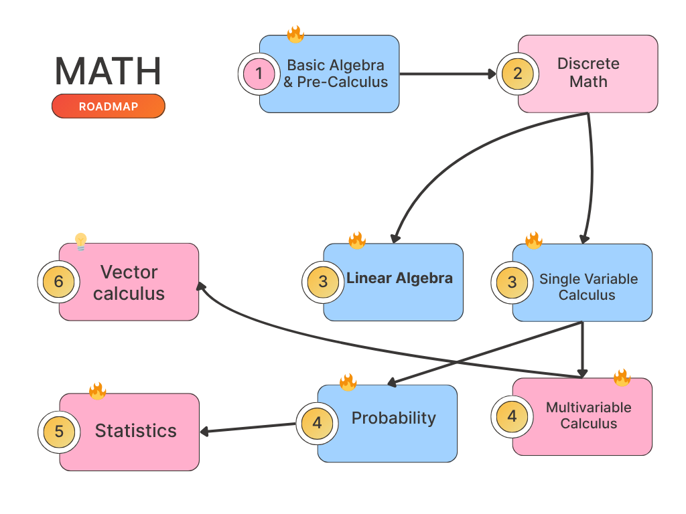

# Project Based AI Roadmap Journey: Brick by Brick

Welcome to the delicious irony of learning AI: your goal is to become a competent engineer who can teach machines to do cool stuff, but here's the kicker, don't learn FROM AI while learning how to MAKE AI learn.

We're drowning in the age of multi-source paralysis, where people never start because there are too many resources, then AI swoops in like an overenthusiastic friend doing your homework while you watch Netflix. Suddenly we're all convinced we're learning while the AI does the thinking. Plot twist: you're not learning; you're becoming an intellectual couch potato.

**Prerequisites**: Your brain. That's it. I might permit a calculator—those ancient relics with actual buttons, but GPT, Claude, or any AI assistant? Absolutely not. We're going full analog, like our ancestors did in the dark ages of... 2010.

Learn the hard way. Struggle through derivations by hand, debug with print statements, calculate gradients until your calculator dies. Why? Because there's a difference between being a chef who creates masterpieces from scratch and someone who can only reheat frozen dinners. Both fill your stomach, but only one feeds your understanding.

In the chess game of human vs. AI, don't let the machine win by forfeit. Become skilled enough to teach it, and maybe keep winning a few games yourself.

## Disclaimer

Important Notice: This repository contains my personal learning notes and implementations created for educational purposes. The content represents my understanding at various stages of learning and may contain errors or oversimplifications.

**For Beginners**: If you're also learning AI, feel free to follow along, but remember to cross-reference with authoritative sources and don't rely solely on these notes.

# Universal Learning Priority Legend

## Priority Levels

| Emoji | Level           | Description                                                     |
| ----- | --------------- | --------------------------------------------------------------- |
| 🔥    | **Must Learn**  | Absolutely essential - skip this at your own peril              |
| ⭐    | **Recommended** | Highly valuable - will make your journey significantly smoother |
| 💡    | **Optional**    | Nice to have - useful but not critical for getting started      |

## Usage Guidelines

## The Roadmap

## The Mathematical

Here's your roadmap through the mathematical wilderness, because jumping straight into neural networks without calculus is like trying to perform brain surgery with a butter knife—technically possible, but inadvisable.


```
                🔥 Basic Algebra & Pre-Calculus
                            │
                    🔥 Discrete Mathematics
                            │
        ┌───────────────────┼───────────────────┐
        │                   │                   │
    🔥 Single Variable     🔥 Logic & Proofs   🔥 Sets & Functions
    Calculus                   │                   │
        │               🔥 Boolean Algebra      🔥 Relations
    🔥 Derivatives             │                   │
        │               ⭐ Propositional        ⭐ Equivalence
    🔥 Integrals           Logic                Relations
        │                   │                   │
        └───────────────────┼───────────────────┘
                            │
        ┌───────────────────┼───────────────────┐
        │                   │                   │
    🔥 Multivariable       ⭐ Graph Theory      💡 Combinatorics
    Calculus                   │                   │
        │               ⭐ Trees & Networks     💡 Counting
    🔥 Partial Derivatives     │               Principles
        │               ⭐ Algorithms on        │
    🔥 Multiple Integrals  Graphs             💡 Permutations &
        │                   │               Combinations
    ⭐ Vector Fields           │                   │
        │                   │                   │
        └───────────────────┼───────────────────┘
                            │
                    ⭐ Vector Calculus
                            │
        ┌───────────────────┼───────────────────┐
        │                   │                   │
    ⭐ Gradient &           ⭐ Line & Surface    💡 Green's & Stokes'
    Divergence             Integrals           Theorems
        │                   │                   │
    ⭐ Curl & Del          ⭐ Vector Fields      💡 Divergence Theorem
    Operator                   │                   │
        │               💡 Conservative         💡 Applications to
    💡 Directional         Fields              Physics
    Derivatives               │                   │
        │                   │                   │
        └───────────────────┼───────────────────┘
                            │
                ═══ The Convergence Point ═══
                            │
                    🔥 Linear Algebra
                            │
        ┌───────────────────┼───────────────────┐
        │                   │                   │
    🔥 Matrices &          🔥 Vector Spaces     🔥 Eigenvalues &
    Determinants               │               Eigenvectors
        │               🔥 Linear                │
    🔥 Matrix Operations   Independence         🔥 Diagonalization
        │                   │                   │
    🔥 Gaussian            🔥 Basis &           ⭐ Singular Value
    Elimination            Dimension          Decomposition
        │                   │                   │
        └───────────────────┼───────────────────┘
                            │
        ┌───────────────────┼───────────────────┐
        │                   │                   │
    🔥 Inner Products      ⭐ Matrix           💡 Tensor Algebra
        │               Decompositions           │
    🔥 Orthogonality       ⭐ LU/QR/Cholesky    💡 Multilinear
        │                   │               Algebra
    ⭐ Gram-Schmidt        💡 Pseudo-inverse     │
    Process                   │               💡 Tensor
        │                   │               Decompositions
        └───────────────────┼───────────────────┘
                            │
                ═══ Advanced Mathematical Tools ═══
                            │
        ┌───────────────────┼───────────────────┐
        │                   │                   │
    🔥 Probability Theory  ⭐ Statistics        ⭐ Optimization Theory
        │                   │                   │
    🔥 Random Variables    ⭐ Descriptive       ⭐ Convex Optimization
        │               Statistics              │
    🔥 Distributions       ⭐ Hypothesis        🔥 Gradient Descent
        │               Testing                 │
    🔥 Bayes' Theorem      ⭐ Confidence        ⭐ Lagrange Multipliers
        │               Intervals              │
    ⭐ Central Limit       💡 Regression        💡 Constrained
    Theorem               Analysis            Optimization
        │                   │                   │
    ⭐ Markov Chains       💡 ANOVA             💡 Linear Programming
        │                   │                   │
        └───────────────────┼───────────────────┘
                            │
            💡 Specialized Mathematical Areas
                            │
        ┌───────────────────┼───────────────────┐
        │                   │                   │
    💡 Real Analysis       💡 Complex Analysis  💡 Differential
        │                   │               Equations
    💡 Measure Theory      💡 Fourier Analysis  💡 ODEs & PDEs
        │                   │                   │
    💡 Functional Analysis 💡 Signal Processing 💡 Dynamical Systems
        │                   │                   │
    💡 Topology            💡 Information       💡 Control Theory
        │               Theory                  │
```

## Developer Tools

### The Command Line Foundation

```
                🔥 Terminal/Command Line
                            │
        ┌───────────────────┼───────────────────┐
        │                   │                   │
    🔥 Git               🔥 SSH             ⭐ Shell Scripting
        │                   │                   │
        │               ⭐ Key Management       │
        │                   │               💡 Advanced Bash
        │               💡 Config Files         │
        │                   │               ⭐ Aliases & Functions
        │               ⭐ tmux                 │
        │                   │               💡 zsh/fish/oh-my-zsh
        │                   │                   │
        └───────────────────┼───────────────────┘
                            │
                    ═══ Text Editor Wars ═══
                            │
        ┌───────────────────┼───────────────────┐
        │                   │                   │
    🔥 VS Code            ⭐ Vim              💡 Emacs
        │                   │                   │
    💡 Extensions         ⭐ Neovim           💡 Spacemacs
        │                   │                   │
    💡 Sublime Text       💡 Vim Plugins      💡 Nano (for emergencies)

```

### The Environment Setup

```
            🔥 Package Managers & Environment
                            │
        ┌───────────────────┼───────────────────┐
        │                   │                   │
    🔥 pip                ⭐ conda            💡 homebrew/apt
        │                   │                   │
    ⭐ virtualenv         ⭐ mamba             💡 snap/flatpak
        │                   │                   │
    💡 pipenv             💡 poetry            💡 asdf/pyenv
        │                   │                   │
        └───────────────────┼───────────────────┘
                            │
                    🔥 Containerization
                            │
                        🔥 Docker
                            │
                    ⭐ Docker Compose
                            │
        ┌───────────────────┼───────────────────┐
        │                   │                   │
    💡 Kubernetes         💡 Podman           💡 Vagrant
        │                   │                   │
    💡 Helm               💡 LXC/LXD          💡 VirtualBox

```

### The Development Workflow

```
                    🔥 IDE/Editor Setup
                            │
        ┌───────────────────┼───────────────────┐
        │                   │                   │
    🔥 Debugger           ⭐ Linting          ⭐ Testing Framework
        │                   │                   │
    🔥 IntelliSense       ⭐ Code Formatting   🔥 Unit Tests
        │                   │                   │
    ⭐ Extensions         💡 Type Checking     ⭐ Integration Tests
        │                   │                   │
        └───────────────────┼───────────────────┘
                            │
        ┌───────────────────┼───────────────────┐
        │                   │                   │
    ⭐ Jupyter Notebook   💡 API Testing      💡 Database Tools
        │                   │                   │
    ⭐ JupyterLab         💡 Postman/Insomnia  💡 pgAdmin/Compass
        │                   │                   │
    💡 Google Colab       💡 HTTPie/curl      💡 DBeaver/Sequel Pro
        │                   │                   │
        └───────────────────┼───────────────────┘
                            │
                🔥 Version Control System
                            │
                        🔥 Git
                            │
        ┌───────────────────┼───────────────────┐
        │                   │                   │
    🔥 GitHub/GitLab      ⭐ Git Hooks        ⭐ Branching Strategy
        │                   │                   │
    ⭐ Pull Requests      💡 Git Flow         💡 Semantic Versioning
        │                   │                   │
        └───────────────────┼───────────────────┘
                            │
                    ⭐ CI/CD Pipeline
                            │
        ┌───────────────────┼───────────────────┐
        │                   │                   │
    ⭐ GitHub Actions     💡 Jenkins          💡 GitLab CI
        │                   │                   │
    💡 Travis CI          💡 CircleCI         💡 Azure DevOps
        │                   │                   │
        └───────────────────┼───────────────────┘
                            │
                💡 Advanced DevOps & Monitoring
                            │
        ┌───────────────────┼───────────────────┐
        │                   │                   │
    💡 Prometheus         💡 ELK Stack        💡 Infrastructure as Code
        │                   │                   │
    💡 Grafana            💡 Splunk           💡 Terraform/Ansible
```

## Programming Fundamentals Roadmap: Before the AI Magic

### The Foundation Layer

```
           🔥 Programming Logic & Thinking
                            │
        ┌───────────────────┼───────────────────     ┐
        │                   │                        │
    🔥 Variables &    🔥 Control Flow         🔥 Functions
    Data Types                 │                     │
        │               🔥 If/Else/Switch     🔥 Parameters
    🔥 Operators              │               🔥 Return Values
        │               🔥 Loops (for/while)         │
    🔥 Type Conversion         │               🔥 Recursion
        │               🔥 Break/Continue            │
        └───────────────────┼───────────────────┘
                            │
                ═══ Language Choice Wars ═══
                            │
        ┌───────────────────┼───────────────────┐
        │                   │                   │
    🔥 Python             ⭐ Java             💡 Typescript
        │                   │                   │
    ⭐ JavaScript         ⭐ C                💡 Rust
        │                   │                   │
    💡 Go                                     💡 Kotlin

```

### Data Structures & Algorithms Foundation

```
                🔥 Basic Data Structures
                            │
        ┌───────────────────┼───────────────────┐
        │                   │                   │
    🔥 Arrays/Lists       🔥 Strings           🔥 Dictionaries/Maps
        │                   │                   │
    🔥 Indexing           🔥 String Methods     🔥 Key-Value Pairs
        │                   │                   │
    ⭐ Multidimensional   ⭐ String Formatting  ⭐ Hash Tables
        │                   │                   │
        └───────────────────┼───────────────────┘
                            │
                ⭐ Intermediate Data Structures
                            │
        ┌───────────────────┼───────────────────┐
        │                   │                   │
    ⭐ Stacks & Queues     ⭐ Sets              💡 Linked Lists
        │                   │                   │
    ⭐ LIFO/FIFO          ⭐ Union/Intersection  💡 Pointers/References
        │                   │                   │
    💡 Priority Queues     💡 Bit Manipulation  ⭐ Trees & Graphs
        │                   │                   │
        └───────────────────┼───────────────────┘
                            │
                🔥 Basic Algorithms
                            │
        ┌───────────────────┼───────────────────┐
        │                   │                   │
    🔥 Searching          🔥 Sorting           ⭐ Algorithm Complexity
        │                   │                   │
    🔥 Linear Search      🔥 Bubble/Selection   ⭐ Big O Notation
        │                   │                   │
    ⭐ Binary Search      ⭐ Quick/Merge Sort   💡 Time/Space Analysis
        │                   │                   │
    ⭐ Trees & Graph Alogirthms


```

### Object-Oriented Programming

```
                🔥 OOP Fundamentals
                            │
        ┌───────────────────┼───────────────────┐
        │                   │                   │
    🔥 Classes &         🔥 Methods &      🔥 Encapsulation
    Objects                 Attributes           │
        │                   │               🔥 Public/Private
    🔥 Instantiation    🔥 Instance vs          │
        │               Class Methods       ⭐ Getters/Setters
    ⭐ Constructors           │                 │
        │                   │                   │
        └───────────────────┼───────────────────┘
                            │
                ⭐ Advanced OOP Concepts
                            │
        ┌───────────────────┼───────────────────┐
        │                   │                   │
    ⭐ Inheritance         ⭐ Polymorphism      💡 Abstraction
        │                   │                   │
    ⭐ Parent/Child        ⭐ Method Overriding  💡 Interfaces
        │                   │                   │
    💡 Multiple            💡 Duck Typing       💡 Abstract Classes
    Inheritance               │                   │

```

### File I/O & Error Handling

```
                    🔥 File Operations
                            │
        ┌───────────────────┼───────────────────┐
        │                   │                   │
    🔥 Reading Files       🔥 Writing Files     🔥 File Paths
        │                   │                   │
    🔥 Text Files          🔥 Append Mode       🔥 Absolute/Relative
        │                   │                   │
    ⭐ CSV/JSON           ⭐ Binary Files       ⭐ Directory Operations
        │                   │                   │
        └───────────────────┼───────────────────┘
                            │
                    🔥 Error Handling
                            │
        ┌───────────────────┼───────────────────┐
        │                   │                   │
    🔥 Try/Catch          🔥 Exception Types    ⭐ Custom Exceptions
        │                   │                   │
    🔥 Finally Blocks     ⭐ Error Messages     💡 Logging
        │                   │                   │
    ⭐ Debugging          💡 Stack Traces      💡 Testing Frameworks

```

### Libraries & Modules

```
                🔥 Code Organization
                            │
        ┌───────────────────┼───────────────────┐
        │                   │                   │
    🔥 Modules/Packages    🔥 Import System     🔥 Standard Library
        │                   │                   │
    🔥 Creating Modules    🔥 from/import       🔥 Built-in Functions
        │                   │                   │
    ⭐ Package Structure   ⭐ Aliasing          ⭐ Common Libraries
        │                   │                   │
        └───────────────────┼───────────────────┘
                            │
                ⭐ External Libraries
                            │
        ┌───────────────────┼───────────────────┐
        │                   │                   │
    ⭐ Package Managers    ⭐ Virtual Environments  💡 Documentation
        │                   │                   │
    🔥 pip/npm/etc        ⭐ Requirements Files   💡 API References
        │                   │                   │
    ⭐ Dependency         💡 Version Control     💡 Code Examples
    Management               │                   │

```

## Database & Data Management Roadmap for AI

### Database Fundamentals

```
                🔥 Database Concepts
                            │
        ┌───────────────────┼───────────────────┐
        │                   │                   │
    🔥 Data Models         🔥 ACID Properties   🔥 Database Design
        │                   │                   │
    🔥 Relational Model    🔥 Atomicity         🔥 Normalization
        │                   │                   │
    🔥 Tables/Rows/        🔥 Consistency       🔥 Primary/Foreign
    Columns                   │               Keys
        │               🔥 Isolation             │
    ⭐ Entity-Relationship 🔥 Durability        ⭐ Indexing Strategy
    Diagrams                  │                   │
        │                   │               ⭐ Query Optimization
        └───────────────────┼───────────────────┘
                            │
                ═══ SQL Mastery ═══
                            │
        ┌───────────────────┼───────────────────┐
        │                   │                   │
    🔥 Basic SQL           🔥 Advanced SQL      ⭐ Database Functions
        │                   │                   │
    🔥 SELECT/FROM/WHERE   🔥 JOINs (Inner/     ⭐ Aggregate Functions
        │               Outer/Left/Right)       │
    🔥 INSERT/UPDATE/      🔥 Subqueries        ⭐ Window Functions
    DELETE                    │                   │
        │               🔥 GROUP BY/HAVING      ⭐ Common Table
    🔥 ORDER BY/LIMIT      🔥 UNION/INTERSECT   Expressions (CTEs)
        │                   │                   │
        └───────────────────┼───────────────────┘
                            │
        ┌───────────────────┼───────────────────┐
        │                   │                   │
    ⭐ Advanced Queries    💡 Stored Procedures 💡 Database Security
        │                   │                   │
    ⭐ Recursive Queries   💡 Triggers          💡 User Management
        │                   │                   │
    ⭐ Performance Tuning  💡 Views             💡 Access Control
        │                   │                   │
    ⭐ Execution Plans     💡 Materialized      💡 Data Encryption
        │               Views                   │
```

### Relational Database Systems

```
                🔥 Popular RDBMS
                            │
        ┌───────────────────┼───────────────────┐
        │                   │                   │
    🔥 PostgreSQL          ⭐ MySQL             💡 Oracle
        │                   │                   │
    🔥 JSON Support        ⭐ InnoDB Engine     💡 Enterprise Features
        │                   │                   │
    🔥 Advanced Data       ⭐ Replication       💡 PL/SQL
    Types                     │                   │
        │               ⭐ Performance         💡 Advanced Analytics
    ⭐ Extensions          Optimization           │
        │                   │                   │
        └───────────────────┼───────────────────┘
                            │
        ┌───────────────────┼───────────────────┐
        │                   │                   │
    💡 Microsoft SQL       💡 SQLite            ⭐ Database
    Server                    │               Administration
        │               💡 Embedded             │
    💡 T-SQL               Database            ⭐ Backup & Recovery
        │                   │                   │
    💡 Integration         💡 Local Development ⭐ Monitoring
    Services                  │                   │
        │               💡 Mobile Apps        ⭐ Performance Tuning
        │                   │                   │
        └───────────────────┼───────────────────┘
                            │
                ⭐ Database Connectivity
                            │
        ┌───────────────────┼───────────────────┐
        │                   │                   │
    🔥 Python DB APIs      ⭐ Connection        ⭐ Database Drivers
        │               Pooling                 │
    🔥 psycopg2/PyMySQL    ⭐ SQLAlchemy        ⭐ JDBC/ODBC
        │                   │                   │
    🔥 Connection          ⭐ ORM Concepts      💡 Connection
    Management                │               Security
        │               ⭐ Query Builders       │
```

### NoSQL & Modern Data Storage

```
                ⭐ Document Databases
                            │
        ┌───────────────────┼───────────────────┐
        │                   │                   │
    ⭐ MongoDB              💡 CouchDB           💡 Amazon DocumentDB
        │                   │                   │
    ⭐ Collections &        💡 Map-Reduce        💡 Azure Cosmos DB
    Documents                 │                   │
        │               💡 CouchDB Queries     💡 Multi-Model
    ⭐ BSON Format         💡 Replication       Database
        │                   │                   │
    ⭐ Aggregation         💡 Conflict          💡 Global Distribution
    Pipeline              Resolution             │
        │                   │                   │
        └───────────────────┼───────────────────┘
                            │
                ⭐ Key-Value & Column Stores
                            │
        ┌───────────────────┼───────────────────┐
        │                   │                   │
    ⭐ Redis               💡 Apache Cassandra  💡 Amazon DynamoDB
        │                   │                   │
    ⭐ Caching             💡 Wide Column        💡 Serverless NoSQL
        │               Family                   │
    ⭐ Pub/Sub             💡 Distributed        💡 Auto-scaling
        │               Architecture            │
    ⭐ Data Structures     💡 Eventually         💡 Global Tables
        │               Consistent              │
        └───────────────────┼───────────────────┘
                            │
                💡 Graph Databases
                            │
        ┌───────────────────┼───────────────────┐
        │                   │                   │
    💡 Neo4j               💡 Amazon Neptune    💡 ArangoDB
        │                   │                   │
    💡 Cypher Query        💡 Property Graph    💡 Multi-Model
    Language                  │               (Graph/Document)
        │               💡 RDF/SPARQL          │
    💡 Graph Algorithms    💡 Graph Analytics   💡 Graph Traversal
        │                   │                   │
    💡 Social Networks     💡 Knowledge Graphs  💡 Recommendation
        │                   │               Systems
```

### Big Data & AI-Specific Storage

```
                🔥 Data Warehousing
                            │
        ┌───────────────────┼───────────────────┐
        │                   │                   │
    🔥 Data Warehouse      ⭐ Data Lakes        ⭐ Data Marts
    Concepts                   │                   │
        │               ⭐ Raw Data Storage     ⭐ Departmental
    🔥 ETL/ELT             ⭐ Schema-on-Read    Focus
    Processes                 │                   │
        │               ⭐ Data Lake           ⭐ OLAP vs OLTP
    🔥 Dimensional         Architecture           │
    Modeling                  │               ⭐ Star/Snowflake
        │                   │               Schema
        └───────────────────┼───────────────────┘
                            │
                ⭐ Big Data Technologies
                            │
        ┌───────────────────┼───────────────────┐
        │                   │                   │
    ⭐ Apache Hadoop       ⭐ Apache Spark      💡 Apache Kafka
        │                   │                   │
    ⭐ HDFS                ⭐ Spark SQL          💡 Stream Processing
        │                   │                   │
    ⭐ MapReduce           ⭐ DataFrames         💡 Real-time Data
        │                   │                   │
    💡 Hive/Pig           ⭐ MLlib              💡 Event Streaming
        │                   │                   │
        └───────────────────┼───────────────────┘
                            │
                🔥 Cloud Data Platforms
                            │
        ┌───────────────────┼───────────────────┐
        │                   │                   │
    🔥 AWS Data Services   ⭐ Google Cloud      ⭐ Azure Data
        │               Platform               Platform
    🔥 S3/RDS/Redshift     ⭐ BigQuery/Cloud    ⭐ SQL Database/
        │               SQL                   Synapse
    ⭐ DynamoDB/EMR        ⭐ Cloud Storage/     ⭐ Cosmos DB/
        │               Dataflow            Data Factory
    ⭐ Athena/Glue         💡 AI Platform       💡 Machine Learning
        │                   │               Studio
        └───────────────────┼───────────────────┘
                            │
                ⭐ AI-Specific Data Storage
                            │
        ┌───────────────────┼───────────────────┐
        │                   │                   │
    ⭐ Vector Databases    ⭐ Time Series       💡 Feature Stores
        │               Databases               │
    ⭐ Pinecone/Weaviate   ⭐ InfluxDB/         💡 Feast/Tecton
        │               TimescaleDB             │
    ⭐ Similarity Search   ⭐ IoT Data          💡 Feature Engineering
        │                   │               Pipeline
    ⭐ Embeddings Storage  ⭐ Monitoring Data   💡 Model Registry
        │                   │                   │
        └───────────────────┼───────────────────┘
                            │
                💡 Specialized AI Storage
                            │
        ┌───────────────────┼───────────────────┐
        │                   │                   │
    💡 MLOps Databases     💡 Experiment       💡 Model Versioning
        │               Tracking               │
    💡 Model Metadata      💡 Weights &        💡 A/B Testing
        │               Biases/MLflow        Data
    💡 Training Data       💡 Hyperparameter    │
    Versioning            Optimization       💡 Performance
        │               Results              Metrics Storage
```

## AI & Machine Learning Roadmap: The Real Magic Begins

### The Data Science Foundation

```
            🔥 Data Manipulation & Analysis
                            │
        ┌───────────────────┼───────────────────┐
        │                   │                   │
    🔥 NumPy              🔥 Pandas            🔥 Data Cleaning
        │                   │                   │
    🔥 Arrays & Matrices   🔥 DataFrames        🔥 Missing Values
        │                   │                   │
    🔥 Mathematical Ops    🔥 CSV/Excel I/O     🔥 Data Types
        │                   │                   │
    ⭐ Broadcasting       ⭐ Groupby/Merge      ⭐ Outlier Detection
        │                   │                   │
        └───────────────────┼───────────────────┘
                            │
                🔥 Data Visualization
                            │
        ┌───────────────────┼───────────────────┐
        │                   │                   │
    🔥 Matplotlib         ⭐ Seaborn           💡 Plotly
        │                   │                   │
    🔥 Basic Plots        ⭐ Statistical Plots  💡 Interactive Plots
        │                   │                   │
    🔥 Customization      ⭐ Heatmaps          💡 Dash/Streamlit
        │                   │                   │
        └───────────────────┼───────────────────┘
                            │
                ⭐ Exploratory Data Analysis
                            │
        ┌───────────────────┼────────────────────────────┐
        │                   │                            │
    🔥 Descriptive Stats  ⭐ Correlation       💡 Feature Engineering
        │                   │                            │
    🔥 Distribution       ⭐ Hypothesis Testing 💡 Dimensionality
        │                   │                       Reduction
    ⭐ Data Profiling     💡 A/B Testing                 │
```

### Machine Learning Fundamentals

```
                🔥 ML Concepts & Theory
                            │
        ┌───────────────────┼───────────────────┐
        │                   │                   │
    🔥 Supervised vs      🔥 Training/Testing  🔥 Overfitting/
    Unsupervised             │               Underfitting
        │               🔥 Train/Val/Test         │
    🔥 Regression vs          │               🔥 Bias-Variance
    Classification        🔥 Cross Validation     │
        │                   │               ⭐ Regularization
    ⭐ Semi-supervised    ⭐ Stratified Split      │
        │                   │                   │
        └───────────────────┼───────────────────┘
                            │
                🔥 Scikit-Learn Ecosystem
                            │
        ┌───────────────────┼───────────────────┐
        │                   │                   │
    🔥 Linear Regression  🔥 Logistic          🔥 Decision Trees
        │               Regression                │
    🔥 Polynomial         🔥 Classification      🔥 Random Forest
        │               Metrics                  │
    ⭐ Ridge/Lasso       🔥 Confusion Matrix     ⭐ Gradient Boosting
        │                   │                   │
        └───────────────────┼───────────────────┘
                            │
                ⭐ Clustering & Unsupervised
                            │
        ┌───────────────────┼───────────────────┐
        │                   │                   │
    🔥 K-Means            ⭐ Hierarchical       💡 DBSCAN
        │               Clustering               │
    🔥 Elbow Method       ⭐ Dendrogram          💡 Gaussian Mixture
        │                   │                   │
    ⭐ PCA                💡 t-SNE              💡 Association Rules
```

### Deep Learning Foundation

```
                🔥 Neural Network Basics
                            │
        ┌───────────────────┼───────────────────┐
        │                   │                   │
    🔥 Perceptron         🔥 Activation         🔥 Backpropagation
        │               Functions                │
    🔥 Multi-layer        🔥 ReLU/Sigmoid       🔥 Gradient Descent
        │                   │                   │
    ⭐ Universal          ⭐ Loss Functions      ⭐ Learning Rate
    Approximation           │                   │
        │               🔥 MSE/CrossEntropy     ⭐ Optimizers
        │                   │                   │
        └───────────────────┼───────────────────┘
                            │
                🔥 Deep Learning Frameworks
                            │
        ┌───────────────────┼───────────────────┐
        │                   │                   │
    🔥 TensorFlow/Keras   ⭐ PyTorch            💡 JAX
        │                   │                   │
    🔥 Sequential Model   ⭐ Dynamic Graphs     💡 Functional API
        │                   │                   │
    🔥 Dense Layers       ⭐ Autograd           💡 Custom Layers
        │                   │                   │
        └───────────────────┼───────────────────┘
                            │
                ⭐ Specialized Architectures
                            │
        ┌───────────────────┼───────────────────┐
        │                   │                   │
    ⭐ Convolutional      ⭐ Recurrent          💡 Transformers
    Neural Networks     Neural Networks           │
        │                   │               💡 Attention
    ⭐ CNN for Images     ⭐ LSTM/GRU          Mechanism
        │                   │                   │
    💡 Transfer Learning  💡 Sequence Models    💡 BERT/GPT Basics
```

### MLOps & Production

```
                ⭐ Model Deployment
                            │
        ┌───────────────────┼───────────────────┐
        │                   │                   │
    ⭐ Model Serialization ⭐ API Development   💡 Cloud Platforms
        │                   │                   │
    🔥 Pickle/Joblib      ⭐ Flask/FastAPI      💡 AWS/GCP/Azure
        │                   │                   │
    ⭐ Model Versioning   ⭐ Docker for ML      💡 MLflow/Weights&Biases
        │                   │                   │
        └───────────────────┼───────────────────┘
                            │
                💡 Advanced MLOps
                            │
        ┌───────────────────┼───────────────────┐
        │                   │                   │
    💡 Model Monitoring   💡 A/B Testing       💡 Feature Stores
        │               for Models               │
    💡 Data Drift         💡 Continuous        💡 AutoML
        │               Integration              │
    💡 Model Retraining   💡 Kubernetes ML     💡 Edge Deployment
```

### Specialized AI Domains

```
                 💡 Computer Vision
                            │
        ┌───────────────────┼───────────────────┐
        │                   │                   │
    💡 OpenCV             💡 Image Processing  💡 Object Detection
        │                   │                   │
    💡 Image Classification 💡 Face Recognition 💡 YOLO/R-CNN
        │                   │                   │
    💡 Image Segmentation 💡 OCR               💡 GANs
        │                   │                   │
        └───────────────────┼───────────────────┘
                            │
                💡 Natural Language Processing
                            │
        ┌───────────────────┼───────────────────┐
        │                   │                   │
    💡 Text Preprocessing  💡 Word Embeddings   💡 Named Entity
        │                   │               Recognition
    💡 Tokenization       💡 Word2Vec/GloVe      │
        │                   │               💡 Question Answering
    💡 Sentiment Analysis 💡 TF-IDF             │
        │                   │               💡 Text Generation
        │                   │                   │
        └───────────────────┼───────────────────┘
                            │
                💡 Reinforcement Learning
                            │
        ┌───────────────────┼───────────────────┐
        │                   │                   │
    💡 Q-Learning         💡 Policy Gradient   💡 Actor-Critic
        │                   │                   │
    💡 Markov Decision    💡 Deep Q-Network     💡 Multi-Agent RL
    Process                 │                   │
        │               💡 OpenAI Gym         💡 Game AI
```

## Advanced AI & Research Roadmap: The Cutting Edge

### Advanced Deep Learning Architectures

```
                🔥 Modern Neural Networks
                            │
        ┌───────────────────┼───────────────────┐
        │                   │                   │
    🔥 Attention           🔥 Transformers      🔥 Self-Attention
    Mechanisms                 │                   │
        │               🔥 Encoder-Decoder      🔥 Multi-Head
    🔥 Seq2Seq                 │               Attention
        │               🔥 Positional Encoding     │
    ⭐ Memory Networks         │               ⭐ Scaled Dot-Product
        │                   │                   │
        └───────────────────┼───────────────────┘
                            │
                🔥 Large Language Models
                            │
        ┌───────────────────┼───────────────────┐
        │                   │                   │
    🔥 BERT Family         🔥 GPT Family        ⭐ T5/UL2
        │                   │                   │
    🔥 RoBERTa/DeBERTa     🔥 GPT-3/4           ⭐ PaLM/LaMDA
        │                   │                   │
    ⭐ ELECTRA/ALBERT      ⭐ ChatGPT/InstructGPT 💡 Chinchilla/Gopher
        │                   │                   │
        └───────────────────┼───────────────────┘
                            │
                ⭐ Advanced Vision Models
                            │
        ┌───────────────────┼───────────────────┐
        │                   │                   │
    ⭐ Vision Transformer  ⭐ CLIP               💡 DALL-E/Midjourney
        │                   │                   │
    ⭐ ResNet/EfficientNet ⭐ Multimodal Models  💡 Stable Diffusion
        │                   │                   │
    💡 Neural Architecture 💡 Few-Shot Learning 💡 NeRF/3D Generation
    Search                   │                   │
```

### AI Research & Theory

```
                🔥 Advanced Optimization
                            │
        ┌───────────────────┼───────────────────┐
        │                   │                   │
    🔥 Advanced Optimizers 🔥 Learning Rate     ⭐ Second-Order Methods
        │               Scheduling               │
    🔥 Adam/AdamW             │               ⭐ Newton/L-BFGS
        │               🔥 Warmup/Decay          │
    ⭐ Lookahead/RAdam        │               💡 Natural Gradients
        │               ⭐ Cyclical LR          │
        └───────────────────┼───────────────────┘
                            │
                ⭐ Advanced Training Techniques
                            │
        ┌───────────────────┼───────────────────┐
        │                   │                   │
    ⭐ Transfer Learning   ⭐ Fine-tuning        ⭐ Knowledge Distillation
        │                   │                   │
    ⭐ Domain Adaptation   ⭐ Parameter-Efficient 💡 Neural Architecture
        │               Fine-tuning            Search
    💡 Meta-Learning          │                   │
        │               ⭐ LoRA/Adapters       💡 AutoML Pipelines
        └───────────────────┼───────────────────┘
                            │
                💡 Theoretical Foundations
                            │
        ┌───────────────────┼───────────────────┐
        │                   │                   │
    💡 Information Theory  💡 Probabilistic     💡 Causal Inference
        │               Models                   │
    💡 PAC Learning       💡 Bayesian Deep      💡 Graph Neural
        │               Learning              Networks
    💡 Complexity Theory  💡 Variational        💡 Geometric Deep
        │               Inference            Learning
```

### Specialized AI Systems

```
                ⭐ Generative AI
                            │
        ┌───────────────────┼───────────────────┐
        │                   │                   │
    ⭐ Generative          ⭐ Variational        ⭐ Diffusion Models
    Adversarial Networks   Autoencoders           │
        │                   │               ⭐ DDPM/DDIM
    ⭐ StyleGAN/BigGAN     ⭐ VAE/β-VAE           │
        │                   │               💡 Score-Based Models
    💡 Conditional GANs   💡 Disentangled       │
        │               Representations      💡 Flow-Based Models
        └───────────────────┼───────────────────┘
                            │
                💡 Multimodal AI
                            │
        ┌───────────────────┼───────────────────┐
        │                   │                   │
    💡 Vision-Language    💡 Audio-Visual       💡 Embodied AI
    Models                 Models                 │
        │                   │               💡 Robotics + AI
    💡 Image Captioning   💡 Speech Recognition  │
        │                   │               💡 Simulation
    💡 Visual QA          💡 Text-to-Speech   Environments
        │                   │                   │
        └───────────────────┼───────────────────┘
                            │
                💡 Advanced RL & Control
                            │
        ┌───────────────────┼───────────────────┐
        │                   │                   │
    💡 Deep RL            💡 Multi-Agent RL     💡 Hierarchical RL
        │                   │                   │
    💡 PPO/A3C/SAC        💡 Game Theory + RL   💡 Meta-RL
        │                   │                   │
    💡 Model-Based RL     💡 Cooperative/       💡 Offline RL
        │               Competitive RL          │
```

### Research & Development Skills

```
                🔥 Research Methodology
                            │
        ┌───────────────────┼───────────────────┐
        │                   │                   │
    🔥 Paper Reading      🔥 Experiment Design  ⭐ Academic Writing
        │                   │                   │
    🔥 Literature Review  🔥 Hypothesis Testing ⭐ Peer Review
        │                   │                   │
    ⭐ Citation Management ⭐ Statistical       💡 Grant Writing
        │               Significance            │
        └───────────────────┼───────────────────┘
                            │
                ⭐ Advanced Implementation
                            │
        ┌───────────────────┼───────────────────┐
        │                   │                   │
    ⭐ Research Codebases  ⭐ Distributed       💡 Custom CUDA
        │               Training              Kernels
    ⭐ Reproducibility    ⭐ Multi-GPU/TPU       │
        │                   │               💡 Hardware
    ⭐ Benchmarking       💡 Model Parallelism Optimization
        │                   │                   │
        └───────────────────┼───────────────────┘
                            │
                💡 Industry & Impact
                            │
        ┌───────────────────┼───────────────────┐
        │                   │                   │
    💡 AI Ethics          💡 Bias & Fairness   💡 AI Safety
        │                   │                   │
    💡 Explainable AI     💡 Privacy-Preserving 💡 Alignment Research
        │               ML                      │
    💡 Regulatory         💡 Federated Learning 💡 AI Governance
    Compliance               │                   │
```

### Cutting-Edge Research Areas

```
                💡 Frontier Research
                            │
        ┌───────────────────┼───────────────────┐
        │                   │                   │
    💡 Foundation Models  💡 Emergent          💡 Multimodal
        │               Capabilities         Foundation Models
    💡 Scaling Laws       💡 In-Context          │
        │               Learning            💡 World Models
    💡 Constitutional AI  💡 Chain-of-Thought    │
        │               Reasoning           💡 Neurosymbolic AI
        └───────────────────┼───────────────────┘
                            │
                💡 Next-Generation AI
                            │
        ┌───────────────────┼───────────────────┐
        │                   │                   │
    💡 Quantum ML         💡 Neuromorphic       💡 Biological
        │               Computing            Computation
    💡 Quantum Advantage  💡 Spiking Neural     │
        │               Networks            💡 DNA Computing
    💡 NISQ Algorithms    💡 Brain-Inspired     │
        │               Architectures       💡 Molecular ML
        └───────────────────┼───────────────────┘
                            │
                💡 AGI Research
                            │
        ┌───────────────────┼───────────────────┐
        │                   │                   │
    💡 Cognitive          💡 Reasoning Systems  💡 Consciousness
    Architectures            │               Models
        │               💡 Symbolic-Neural      │
    💡 Memory Systems     Integration           💡 Theory of Mind
        │                   │                   │
    💡 Lifelong Learning  💡 Common Sense      💡 Self-Improving
        │               Reasoning            Systems
```

## Soft Skills Roadmap: The Human Side of AI Engineering

### Communication & Collaboration

```
                🔥 Technical Communication
                            │
        ┌───────────────────┼───────────────────┐
        │                   │                   │
    🔥 Explaining Complex  🔥 Documentation     🔥 Stakeholder
    Concepts                   │               Communication
        │               🔥 Code Comments           │
    🔥 Non-Technical          │               🔥 Business Language
    Translation           🔥 README/Wiki          │
        │                   │               ⭐ Executive Summaries
    ⭐ Visual Storytelling ⭐ API Documentation    │
        │                   │                   │
        └───────────────────┼───────────────────┘
                            │
                🔥 Team Collaboration
                            │
        ┌───────────────────┼───────────────────┐
        │                   │                   │
    🔥 Code Reviews        🔥 Pair Programming  ⭐ Cross-Functional
        │                   │               Teams
    🔥 Constructive        🔥 Knowledge Sharing    │
    Feedback                   │               ⭐ Remote Collaboration
        │               ⭐ Mentoring             │
    ⭐ Conflict Resolution ⭐ Teaching Skills    💡 Team Leadership
        │                   │                   │
        └───────────────────┼───────────────────┘
                            │
                ⭐ Presentation Skills
                            │
        ┌───────────────────┼───────────────────┐
        │                   │                   │
    ⭐ Technical Talks     ⭐ Data Storytelling  💡 Conference Speaking
        │                   │                   │
    🔥 Demo Presentations  ⭐ Visualization      💡 Workshop Facilitation
        │               Design                   │
    ⭐ Slide Design       💡 Interactive Demos  💡 Panel Discussions
        │                   │                   │
```

### Problem-Solving & Critical Thinking

```
                🔥 Analytical Thinking
                            │
        ┌───────────────────┼───────────────────┐
        │                   │                   │
    🔥 Problem             🔥 Root Cause        🔥 Systems Thinking
    Decomposition          Analysis                │
        │                   │               🔥 Understanding
    🔥 Requirements        🔥 Debugging         Dependencies
    Analysis               Methodology             │
        │                   │               ⭐ Holistic View
    ⭐ Edge Case           ⭐ Hypothesis Testing    │
    Identification            │                   │
        └───────────────────┼───────────────────┘
                            │
                ⭐ Creative Problem Solving
                            │
        ┌───────────────────┼───────────────────┐
        │                   │                   │
    ⭐ Alternative         ⭐ Lateral Thinking   💡 Design Thinking
    Approaches                 │                   │
        │               ⭐ Brainstorming        💡 Innovation
    ⭐ Constraint             │               Methodology
    Thinking              💡 Analogical           │
        │               Reasoning            💡 Prototyping
    💡 First Principles       │               Mindset
        │                   │                   │
        └───────────────────┼───────────────────┘
                            │
                🔥 Decision Making
                            │
        ┌───────────────────┼───────────────────┐
        │                   │                   │
    🔥 Risk Assessment     🔥 Trade-off         ⭐ Data-Driven
        │               Analysis             Decisions
    🔥 Cost-Benefit        🔥 Prioritization       │
        │                   │               ⭐ Uncertainty
    ⭐ Scenario Planning   ⭐ Time Management   Handling
        │                   │                   │
```

### Business & Domain Understanding

```
                🔥 Business Acumen
                            │
        ┌───────────────────┼───────────────────┐
        │                   │                   │
    🔥 Understanding       🔥 ROI & Value       ⭐ Industry Knowledge
    Business Goals         Proposition             │
        │                   │               ⭐ Market Dynamics
    🔥 User/Customer      🔥 Resource              │
    Perspective           Constraints         ⭐ Competitive
        │                   │               Analysis
    ⭐ Product Thinking   ⭐ Budget Awareness      │
        │                   │                   │
        └───────────────────┼───────────────────┘
                            │
                ⭐ Domain Expertise
                            │
        ┌───────────────────┼───────────────────┐
        │                   │                   │
    ⭐ Industry-Specific   ⭐ Regulatory        💡 Subject Matter
    Knowledge             Compliance          Expertise
        │                   │                   │
    ⭐ Workflow            ⭐ Ethical           💡 Research Domain
    Understanding         Considerations      Knowledge
        │                   │                   │
    💡 Historical Context 💡 Future Trends     💡 Cross-Industry
        │                   │               Insights
        └───────────────────┼───────────────────┘
                            │
                🔥 Project Management
                            │
        ┌───────────────────┼───────────────────┐
        │                   │                   │
    🔥 Timeline Planning   🔥 Scope Management  ⭐ Agile/Scrum
        │                   │                   │
    🔥 Milestone Tracking  🔥 Resource Planning ⭐ Risk Management
        │                   │                   │
    ⭐ Stakeholder        ⭐ Quality Assurance  💡 Program Management
    Management               │                   │
```

### Continuous Learning & Adaptability

```
                🔥 Learning Mindset
                            │
        ┌───────────────────┼───────────────────┐
        │                   │                   │
    🔥 Curiosity &         🔥 Self-Directed     🔥 Staying Current
    Growth Mindset         Learning                │
        │                   │               🔥 Technology Trends
    🔥 Embracing           🔥 Research Skills       │
    Challenges                │               ⭐ Industry News
        │               ⭐ Online Courses         │
    ⭐ Learning from      ⭐ Reading Papers       💡 Future-Proofing
    Failure                   │               Skills
        └───────────────────┼───────────────────┘
                            │
                ⭐ Adaptability
                            │
        ┌───────────────────┼───────────────────┐
        │                   │                   │
    ⭐ Change Management   ⭐ Flexibility        💡 Pivot Strategies
        │                   │                   │
    🔥 New Technology      ⭐ Context Switching  💡 Career Pivoting
    Adoption                  │                   │
        │               ⭐ Multi-tasking       💡 Skill
    ⭐ Feedback               │               Transferability
    Integration           💡 Stress Management    │
        │                   │                   │
        └───────────────────┼───────────────────┘
                            │
                💡 Teaching & Knowledge Sharing
                            │
        ┌───────────────────┼───────────────────┐
        │                   │                   │
    💡 Mentoring Others    💡 Content Creation  💡 Community Building
        │                   │                   │
    ⭐ Blog Writing        💡 Tutorial Making   💡 Open Source
        │                   │               Contribution
    ⭐ Internal Training   💡 Speaking          │
        │               Engagements         💡 Building Personal
    💡 Knowledge           │               Brand
    Documentation       💡 Thought Leadership    │
```

### Professional Development

```
                ⭐ Networking & Relationships
                            │
        ┌───────────────────┼───────────────────┐
        │                   │                   │
    ⭐ Professional        ⭐ Industry Events   💡 Social Media
    Networks                   │               Presence
        │               ⭐ Conferences            │
    ⭐ Internal            ⭐ Meetups            💡 LinkedIn
    Relationships             │               Optimization
        │               💡 Online Communities    │
    💡 Mentorship         💡 Hackathons        💡 Twitter/X/reddit for Tech
    Networks                  │                   │
        └───────────────────┼───────────────────┘
                            │
                💡 Leadership & Influence
                            │
        ┌───────────────────┼───────────────────┐
        │                   │                   │
    💡 Technical           💡 Vision Setting    💡 Strategic Thinking
    Leadership                 │                   │
        │               💡 Inspiring Others     💡 Organizational
    💡 Team Building          │               Impact
        │               💡 Change Advocacy      │
    💡 Delegation         💡 Decision           💡 Executive
        │               Authority            Presence
        └───────────────────┼───────────────────┘
                            │
                    💡 Career Strategy
                            │
        ┌───────────────────┼───────────────────┐
        │                   │                   │
    💡 Personal Branding   💡 Goal Setting      💡 Market Positioning
        │                   │                   │
    💡 Portfolio Building  💡 Skill Gap         💡 Salary Negotiation
        │               Analysis                │
    💡 Interview Skills   💡 Career Path       💡 Equity & Compensation
        │               Planning              Understanding
```

# License

This project is for educational purposes. MIT © Mahmoud Ahmed

# Contributing

Contributions welcome! Fork the repository, make your changes, and submit a pull request.

## Quick Steps

1. Fork the repo
2. Create a feature branch
3. Make your changes
4. Submit a pull request

Please follow existing same style.
